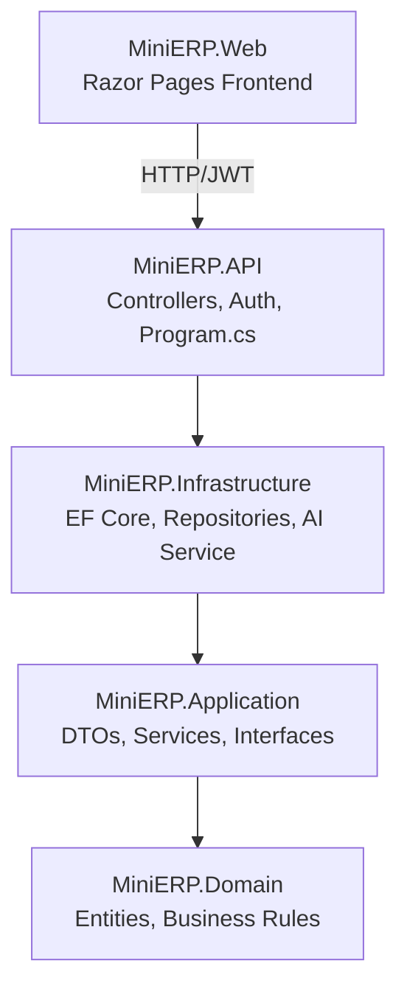
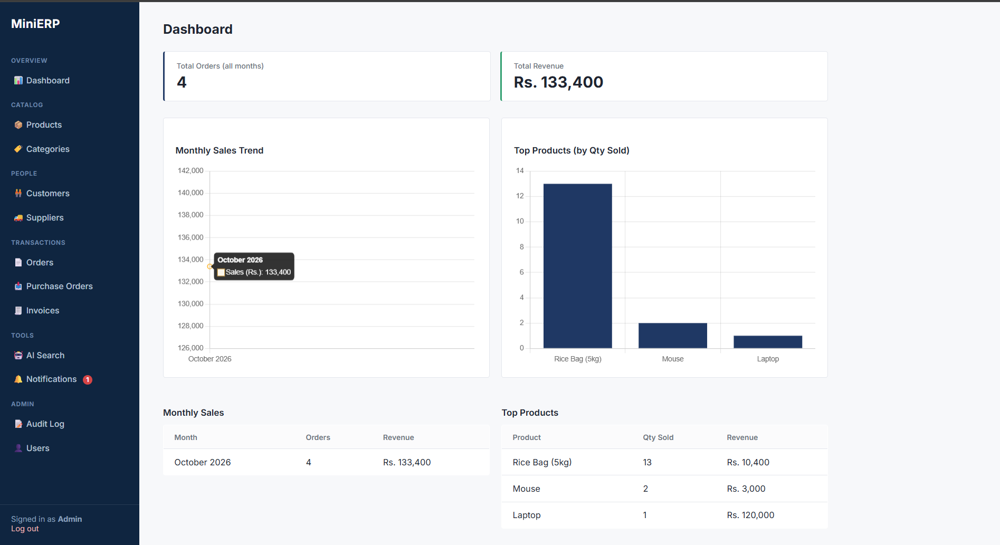
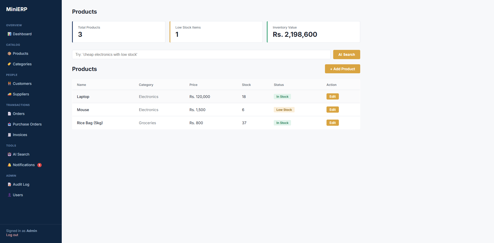
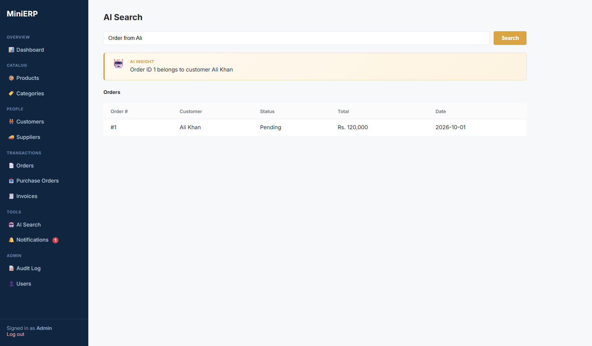
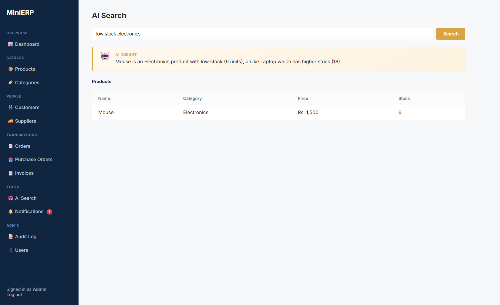
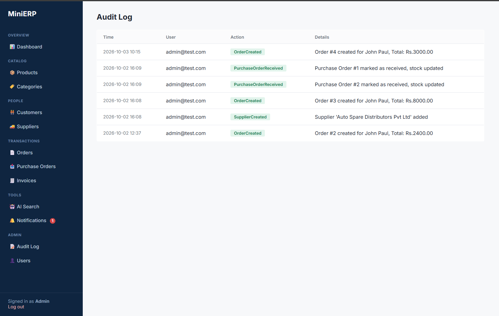
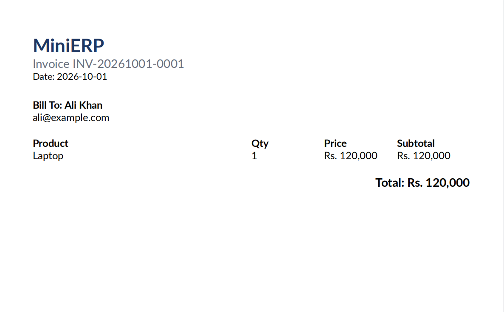
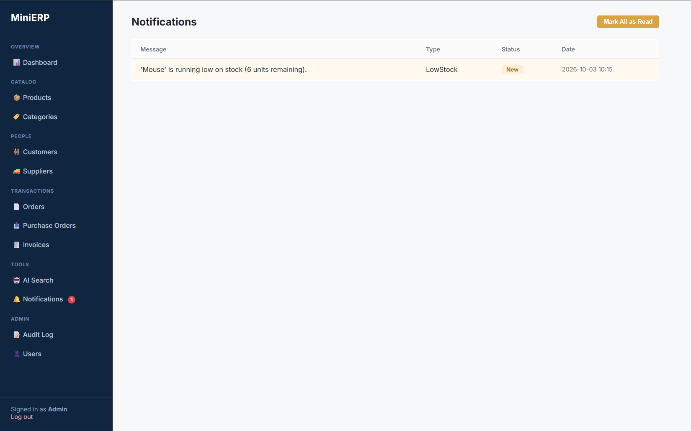

# MiniERP

A full-stack Enterprise Resource Planning system built with **.NET 10**, demonstrating Clean/Onion Architecture, role-based authentication, business workflow automation, AI-powered search, and cloud deployment — built as a hands-on portfolio project to apply enterprise .NET patterns end-to-end.

**Live Demo:** [erp.aamirzaib.dev](https://erp.aamirzaib.dev)
**API Docs:** [api.aamirzaib.dev](https://api.aamirzaib.dev)

---

## Overview

MiniERP covers a complete sales-to-purchase business cycle:

- Catalog management (Products, Categories)
- Customer & Supplier relationship tracking
- Sales orders with automatic stock deduction and status workflow
- Purchase orders with automatic stock replenishment
- Invoice generation (PDF)
- Role-based dashboards and reporting
- AI-powered natural language search across the entire system
- Full audit trail and low-stock notifications

Built to demonstrate the kind of system design and architectural thinking expected in a Senior .NET Engineer role — not just CRUD, but the business logic, security, and operational concerns of a real enterprise application.

---

## Architecture

The backend follows **Onion (Clean) Architecture** with strict dependency rules — the Domain layer has zero external dependencies, and all outward layers depend inward only.



**Key patterns used:**
- Repository + Unit of Work for data access
- DTOs at every API boundary (Domain entities are never exposed directly — avoids serialization issues and over-posting vulnerabilities)
- Service layer encapsulating business rules (stock validation, order status transitions, invoice generation)
- Dependency Injection throughout, interfaces defined in the Application layer and implemented in Infrastructure

---

## Tech Stack

| Layer | Technology |
|---|---|
| Backend | ASP.NET Core Web API (.NET 10) |
| ORM | Entity Framework Core |
| Database | Azure SQL Database |
| Auth | ASP.NET Core Identity + JWT Bearer tokens, role-based (Admin / Sales / Warehouse Staff) |
| Frontend | ASP.NET Core Razor Pages, custom CSS design system |
| AI | Anthropic Claude API — natural language search across Products, Customers, Orders, Categories |
| PDF Generation | QuestPDF |
| Hosting | Azure App Service (Linux) — separate services for API and Web |
| CI/CD | GitHub Actions (auto-deploy on push to `main`) |
| Domain / SSL | Custom domain with free Azure-managed TLS certificate |

---

## Core Features

### Business Modules
- **Products & Categories** — full CRUD, computed low-stock flagging
- **Customers & Suppliers** — relationship management
- **Sales Orders** — stock validation before order creation, automatic stock deduction, enforced status workflow (Pending → Processing → Shipped / Cancelled)
- **Purchase Orders** — supplier ordering with automatic stock replenishment on receipt
- **Invoicing** — one-click PDF invoice generation from an order, duplicate-prevention logic
- **Reporting** — monthly sales summary, top-selling products (Admin only)

### Platform Features
- **JWT Authentication** with three distinct roles and endpoint-level authorization
- **AI Smart Search** — plain-English product search ("cheap electronics with low stock") resolved by Claude against the live catalog
- **AI Global Search** — a single search box that determines which module (products/customers/orders/categories) a query is about and returns matching records — with API-cost protection via per-user and global daily rate limits
- **Audit Log** — every create/update/critical action is recorded with user, timestamp, and details
- **Low-Stock Notifications** — automatically generated when stock drops below threshold, with an unread-count badge in the UI

---

## Screenshots

### Dashboard


### Products


### AI Smart Search



### Audit Logs


### Invoice PDF


### Notification


---

## Security Notes

- Domain entities are never serialized directly to API responses — all responses pass through DTOs, preventing both circular-reference bugs and accidental data exposure.
- Public self-registration only grants the lowest-privilege role; elevated roles can only be assigned by an existing Admin through a protected endpoint.
- AI search endpoints are rate-limited (per-user and global daily caps) to protect against cost-abuse on a public-facing demo.
- Secrets (connection strings, JWT signing key, AI API key) are never committed to source control — managed via .NET User Secrets locally and Azure App Service configuration in production.

---

## Running Locally

```bash
# Clone the repo
git clone https://github.com/AamirZaib/MiniERP.git
cd MiniERP

# Restore and build
dotnet restore
dotnet build

# Set up secrets (API project)
cd MiniERP.API
dotnet user-secrets set "ConnectionStrings:DefaultConnection" "<your-sql-connection-string>"
dotnet user-secrets set "JwtSettings:SecretKey" "<a-32+-character-secret>"
dotnet user-secrets set "ClaudeApiKey" "<your-anthropic-api-key>"

# Apply migrations
dotnet ef database update --project ../MiniERP.Infrastructure --startup-project .

# Run both projects (API + Web)
dotnet run --project ../MiniERP.API
dotnet run --project ../MiniERP.Web
```

---

## Project Structure

```
MiniERP/
├── MiniERP.Domain/          # Entities, enums, domain exceptions — no external dependencies
├── MiniERP.Application/     # DTOs, service interfaces, business logic services
├── MiniERP.Infrastructure/  # EF Core DbContext, repositories, AI integration, Identity
├── MiniERP.API/              # Controllers, JWT auth setup, Program.cs
└── MiniERP.Web/               # Razor Pages frontend, API client service
```

---

## About This Project

Built by [Aamir Zaib](https://www.linkedin.com/in/aamirzaib) — Senior .NET Software Engineer with 6+ years building CRM, ERP, and e-commerce systems. This project was built hands-on, end-to-end, to deepen architecture, cloud, and AI-integration skills beyond day-to-day work.
